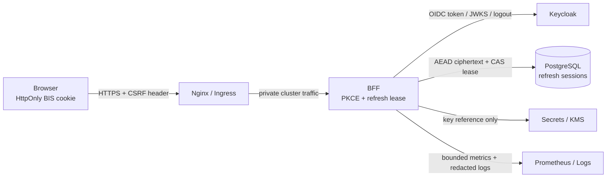

# Staging Chaos Engineering and STRIDE Threat Model for BFF Refresh Sessions

**Author:** Manus AI  
**Status:** Implementation reference. The experiments below are intentionally scoped to staging namespaces and synthetic users. They must not be pointed at production without a separately approved change, legal review where required, a verified rollback owner, and customer-impact controls.

## 1. Safety Model for Identity Chaos Testing

The Keycloak outage workflow must validate the BFF’s intended boundary: local BIS sessions may continue only within their explicit local-cookie and route-assurance policy, while new login, OIDC callback completion, token refresh, and fresh-assurance actions fail closed when Keycloak is unreachable. No experiment should inspect, record, or emit an authorization code, PKCE verifier, access token, refresh token, ciphertext, or user identifier in experiment annotations, metrics, or logs.

Chaos Mesh `NetworkChaos` supports directed partitions, network emulation, and bandwidth restrictions selected by Kubernetes namespaces and labels. [1] Litmus network experiments can target a named destination and explicitly warn that a network fault may not make a pod unhealthy unless an appropriate application-level check exists. [2] The BFF drill must therefore test user-visible behavior, alerting, and lease cleanup—not merely pod liveness.

| Guardrail | Required implementation |
|---|---|
| Environment boundary | Enforce `environment=staging` admission policy and namespace allow-list; no production namespace may appear in a chaos target selector. |
| Blast radius | Select only `app.kubernetes.io/component=bff` pods in `bis-staging`, and target only Keycloak’s service labels/port. |
| Identity data | Use two synthetic Keycloak users and a test realm; do not use copied production sessions or credentials. |
| Kill switch | Require an owner annotation and finite duration; `kubectl delete` must remove the fault immediately. |
| Preconditions | BFF replicas, PostgreSQL, metrics scraping, Alertmanager test receiver, Keycloak readiness, and synthetic auth check must be healthy. |
| Abort conditions | Any namespace scope mismatch, token appearing in logs, non-synthetic account action, database unavailability, or unexpected privilege success terminates the experiment. |
| Recovery proof | Re-run synthetic sign-in and a new, non-replayed refresh after fault removal; verify no active expired refresh lease remains. |

## 2. Chaos Mesh: Directed Keycloak Partition

### 2.1 Installation and policy prerequisites

Install Chaos Mesh only in the dedicated staging cluster. Give its service account the smallest namespace-scoped RBAC policy that can create `NetworkChaos` only in `bis-staging`; do not grant cluster-admin merely for test convenience. Admission control should reject an experiment if any of these fields are absent: an expiry annotation, an incident/change ticket, `environment=staging`, an approved owner, and the BFF/Keycloak selectors shown below.

```yaml
# Kubernetes policy intent; implement with Kyverno, Gatekeeper, or ValidatingAdmissionPolicy.
apiVersion: v1
kind: ConfigMap
metadata:
  name: chaos-policy-contract
  namespace: bis-staging
data:
  allowedNamespaces: bis-staging
  requiredLabels: environment=staging,owner,change-ticket
  requiredAnnotation: chaos.bis.example.com/expires-at
  forbiddenNamespaces: default,kube-system,production,bis-production
```

### 2.2 Outage experiment

This experiment blocks only BFF egress to Keycloak’s HTTPS endpoint. The `direction: to` relationship mirrors the outage experienced by BFF refresh and PKCE server routes; it does not affect Keycloak-to-BFF observability paths or unrelated services.

```yaml
# chaos/keycloak-outage-networkchaos.yaml
apiVersion: chaos-mesh.org/v1alpha1
kind: NetworkChaos
metadata:
  name: bff-to-keycloak-outage
  namespace: bis-staging
  labels:
    environment: staging
    owner: identity-platform
    change-ticket: CHG-STG-KEYCLOAK-OUTAGE
  annotations:
    chaos.bis.example.com/expires-at: "2026-08-18T19:00:00Z"
    chaos.bis.example.com/abort-runbook: "docs/KEYCLOAK_OUTAGE_CICD_AND_SECURITY_PLAYBOOK.md"
spec:
  action: partition
  mode: all
  duration: "5m"
  selector:
    namespaces: [bis-staging]
    labelSelectors:
      app.kubernetes.io/name: bis-auth
      app.kubernetes.io/component: bff
      environment: staging
  direction: to
  target:
    mode: all
    selector:
      namespaces: [identity-staging]
      labelSelectors:
        app.kubernetes.io/name: keycloak
        environment: staging
```

Run only after a preflight job creates an evidence directory and confirms the synthetic users. The job intentionally uses no token values as output.

```bash
#!/usr/bin/env bash
# scripts/chaos/preflight-keycloak-outage.sh
set -Eeuo pipefail

[[ "${KUBE_CONTEXT:-}" == "bis-staging" ]] || { echo "refusing non-staging context" >&2; exit 64; }
kubectl get ns bis-staging -o jsonpath='{.metadata.labels.environment}' | grep -qx staging
kubectl -n bis-staging get deploy -l app.kubernetes.io/component=bff
./scripts/synthetic-auth-check.sh staging baseline
./scripts/assert-no-active-chaos.sh bis-staging
./scripts/assert-alert-receiver.sh staging
```

### 2.3 Success criteria and probes

| Probe | Expected during fault | Expected after recovery |
|---|---|---|
| Existing valid, outage-tolerant local session | Only policy-allowed routes work; no implicit token refresh occurs. | Session continues only until normal local expiry. |
| Two-tab refresh race | One lease claim reaches provider-unavailable path; peer tab receives bounded wait/error. | A new transaction makes one successful Keycloak refresh; old timed-out token is never replayed. |
| New login | No BIS session is issued; user receives a bounded availability state. | Login succeeds through a new PKCE transaction. |
| High-risk action | Denied when fresh assurance is required. | Requires normal fresh assurance. |
| BFF metrics | `provider_unavailable` rises; p95 refresh latency remains bounded by timeout; no infinite retry growth. | Error ratio returns to baseline; no orphaned leases. |
| Alerts | User-impact/IdP dependency alert fires only after configured duration. | Alert resolves automatically with recorded recovery evidence. |

```bash
# Start and stop commands are staging-only and must be recorded in the change ticket.
kubectl apply -f chaos/keycloak-outage-networkchaos.yaml
./scripts/chaos/run-keycloak-outage-probes.sh --environment staging --synthetic-user-a --synthetic-user-b
kubectl delete -f chaos/keycloak-outage-networkchaos.yaml --ignore-not-found
./scripts/synthetic-auth-check.sh staging post-chaos
./scripts/assert-refresh-leases-clean.sh staging
```

## 3. Litmus Alternative: Targeted Network Fault and Workflow Gate

Choose Litmus when the platform standardizes on `ChaosEngine`/`ChaosExperiment` workflows and their probes. Do not deploy Chaos Mesh and Litmus to drive the same fault simultaneously; one controller must own the blast radius.

```yaml
# chaos/litmus/bff-keycloak-network-loss.yaml
apiVersion: litmuschaos.io/v1alpha1
kind: ChaosEngine
metadata:
  name: bff-keycloak-network-loss
  namespace: bis-staging
  labels:
    environment: staging
    owner: identity-platform
    change-ticket: CHG-STG-KEYCLOAK-OUTAGE
spec:
  appinfo:
    appns: bis-staging
    applabel: app.kubernetes.io/name=bis-auth,app.kubernetes.io/component=bff,environment=staging
    appkind: deployment
  chaosServiceAccount: bis-chaos-runner
  jobCleanUpPolicy: delete
  engineState: active
  annotationCheck: "true"
  chaosServiceAccountAnnotations:
    chaos.bis.example.com/expires-at: "2026-08-18T19:00:00Z"
  experiments:
    - name: pod-network-loss
      spec:
        components:
          env:
            - name: DESTINATION_HOSTS
              value: "keycloak.identity-staging.svc.cluster.local"
            - name: TOTAL_CHAOS_DURATION
              value: "300"
            - name: NETWORK_PACKET_LOSS_PERCENTAGE
              value: "100"
        probe:
          - name: bff-refresh-fails-boundedly
            type: cmdProbe
            mode: Edge
            runProperties:
              probeTimeout: 15
              interval: 10
              retry: 1
            cmdProbe/inputs:
              command: >-
                ./scripts/chaos/assert-refresh-outage-contract.sh staging
              comparator:
                type: string
                criteria: equals
                value: "PASS"
```

The exact Litmus API versions and `cmdProbe` syntax should be rendered and validated against the selected installed Litmus version before application. The essential control is the destination host, staging-only app selector, finite fault duration, and a probe that asserts an authentication contract rather than merely a pod state.

## 4. Automated Chaos Pipeline Gate

Chaos testing belongs in a protected staging deployment workflow, not in pull-request CI or a production deployment job. GitHub Actions should use a short-lived OIDC-issued cloud identity restricted to the staging cluster; it must not rely on a long-lived kubeconfig secret. [3]

```yaml
# .github/workflows/staging-auth-chaos.yml
name: Staging Authentication Chaos
on:
  workflow_dispatch:
    inputs:
      controller:
        description: "Fault controller"
        required: true
        type: choice
        options: [chaos-mesh, litmus]
      change_ticket:
        required: true
      expected_duration_minutes:
        required: true
        default: "5"
permissions:
  contents: read
  id-token: write
concurrency:
  group: staging-auth-chaos
  cancel-in-progress: false
jobs:
  chaos:
    environment: staging-chaos
    runs-on: ubuntu-24.04
    timeout-minutes: 30
    steps:
      - uses: actions/checkout@v6
      - name: Acquire scoped staging workload identity
        uses: your-cloud-provider/configure-cloud-credentials@v1
        with:
          role-to-assume: ${{ vars.STAGING_CHAOS_ROLE }}
          audience: ${{ vars.STAGING_CHAOS_OIDC_AUDIENCE }}
      - name: Preflight and snapshot evidence
        run: |
          export KUBE_CONTEXT=bis-staging
          ./scripts/chaos/preflight-keycloak-outage.sh
          ./scripts/chaos/capture-baseline.sh artifacts
      - name: Inject finite staging-only fault
        run: ./scripts/chaos/apply-controller.sh "${{ inputs.controller }}" "${{ inputs.change_ticket }}"
      - name: Assert user and lease contract
        run: ./scripts/chaos/run-keycloak-outage-probes.sh --environment staging --artifacts artifacts
      - name: Always remove fault and verify recovery
        if: always()
        run: |
          ./scripts/chaos/delete-controller.sh "${{ inputs.controller }}" || true
          ./scripts/synthetic-auth-check.sh staging post-chaos
          ./scripts/assert-refresh-leases-clean.sh staging
      - uses: actions/upload-artifact@v4
        if: always()
        with:
          name: staging-auth-chaos-evidence-${{ github.run_id }}
          path: artifacts/
```

## 5. STRIDE Threat Model: BFF Refresh and Session Persistence

Microsoft describes STRIDE as a way to structure questions about authentication data, persistent data modification, data exposure, service denial, and privilege gain. [4] The analysis below treats the browser, Nginx/Ingress, BFF, Keycloak, PostgreSQL refresh-session store, key-management service, and metrics/logging stack as distinct trust boundaries.



| STRIDE category | Relevant threat | Primary control | Verification | Residual risk |
|---|---|---|---|---|
| Spoofing | Forged BIS cookie, callback mix-up, issuer/audience substitution, or stolen browser cookie. | Server-only signing key, `HttpOnly; Secure; SameSite`, PKCE S256, one-time state/nonce, strict issuer/audience/`azp`/`sub` checks, TLS and trusted proxy configuration. | Forged-cookie tests; state replay/mismatch tests; JWT key rotation test; browser CSRF test. | Endpoint compromise or browser malware can still steal an active cookie; reduce lifetime and require fresh assurance for high-risk actions. |
| Tampering | Changing refresh row version/lease, ciphertext/IV/tag, redirect state, or rollout feature flag. | PostgreSQL CAS `UPDATE … WHERE version`, AEAD encryption with authenticated metadata, least-privilege DB role, immutable deployment provenance, admission policy. | Concurrent lease race test; ciphertext corruption test; unauthorized migration/flag change rejection. | Privileged database/KMS administrator compromise requires audit and global invalidation. |
| Repudiation | User/operator denies refresh, session revoke, global epoch change, or feature-flag activation. | Append-only audited events with actor, UTC time, correlation ID, reason code, deployment revision, and dual approval for global actions. | Audit completeness test; permission and signature verification; incident drill review. | Audit-store compromise/retention failure needs external immutable log sink and retention controls. |
| Information disclosure | Tokens, PKCE verifier, session identifiers, KMS data, or PII leak through browser storage, logs, metrics, backups, traces, or error pages. | Browser never receives refresh token; BFF encrypts at rest; redaction middleware; bounded metrics labels; secret scans; encrypted backups; private `/metrics`. | Log/metric negative tests; repository/CI secret scan; backup restore access test. | Memory scraping on a compromised BFF host or KMS exposure; limit access and rotate secrets on suspicion. |
| Denial of service | Refresh storm, lease starvation, IdP outage, database failover, callback flood, or chaos-controller mis-scope. | Lease TTL, browser single-flight, per-session/IP rate limits, bounded provider timeout, circuit breaker, readiness split, HPA/PDB, staging-only chaos admission policy. | Two-tab/two-pod tests; Keycloak outage chaos drill; DB failover drill; rate-limit test. | Legitimate flash crowds can still exhaust upstream IdP capacity; use capacity planning and degraded-mode policy. |
| Elevation of privilege | Refresh returns a different `sub`, stale role claims authorize privileged action, admin caller invokes global invalidation without approval. | Bind session to Keycloak `sub`, verify token claims every rotation, minimize roles in local cookie, fresh assurance for sensitive actions, role checks on admin endpoints, dual control. | Subject-mismatch test; role-revocation test; privileged action during outage test; admin approval test. | Delayed Keycloak role propagation; sensitive actions must query/revalidate according to risk policy. |

### 5.1 Prioritized control backlog

| Priority | Control | Reason for priority |
|---|---|---|
| P0 | Refresh session table with AEAD ciphertext, version, lease, revoke state, and global epoch. | It is the authority for safe rotation and containment. |
| P0 | PKCE/state/nonce transaction store plus strict Keycloak token validation. | Prevents code interception, callback mix-up, and issuer/subject confusion. |
| P0 | No refresh token in browser, metrics, logs, traces, or incident artifacts. | A token leak creates a direct session compromise path. |
| P0 | Bounded refresh timeout/circuit breaker and single-flight lease. | Prevents outage-triggered replay or retry storms. |
| P1 | Immutable audit events and dual control for global invalidation/key rotation. | Enables investigation and limits privileged misuse. |
| P1 | Staging-only Chaos Mesh or Litmus admission policy and automated recovery probes. | Validates the intended safety contract before production incidents. |
| P2 | Continuous threat-model review on schema, IdP, KMS, proxy, and deployment changes. | Keeps controls aligned as trust boundaries evolve. |

## References

[1] [Chaos Mesh: Simulate Network Faults](https://chaos-mesh.org/docs/simulate-network-chaos-on-kubernetes/)  
[2] [Litmus: Pod Network Latency Experiment](https://litmuschaos.github.io/litmus/experiments/categories/pods/pod-network-latency/)  
[3] [GitHub Actions: OpenID Connect](https://docs.github.com/en/actions/concepts/security/openid-connect)  
[4] [Microsoft Threat Modeling Tool: STRIDE Threats](https://learn.microsoft.com/en-us/azure/security/develop/threat-modeling-tool-threats)
