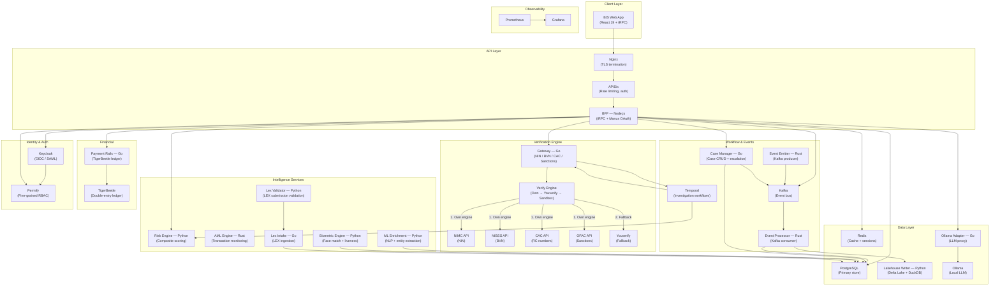

# BIS Platform — Architecture Reference

**Background Intelligence System (BIS)** is a multi-service platform for Nigerian identity verification, AML/CFT compliance, risk scoring, case management, and financial intelligence. This document describes the system architecture, data flows, and service boundaries.

---

## High-Level Architecture



---

## Service Inventory

| Service | Language | Port | Role |
|---|---|---|---|
| **bff** | Node.js / TypeScript | 3001 | tRPC BFF, Manus OAuth, session management |
| **gateway** | Go | 8081 | Nigerian identity verification (NIN/BVN/CAC/Sanctions) |
| **risk-engine** | Python | 8082 | Composite risk scoring (ML + rule-based) |
| **event-processor** | Rust | 8083 | Kafka consumer, event persistence |
| **biometric-engine** | Python | 8084 | Face match, liveness detection, document OCR |
| **lakehouse-writer** | Python | 8085 | Delta Lake writer, DuckDB analytics |
| **ml-enrichment** | Python | 8086 | NLP entity extraction, name matching |
| **risk-scoring** | Python | 8087 | Risk tier calculation (critical/high/medium/low) |
| **case-manager** | Go | 8089 | Case CRUD, escalation, field agent assignment |
| **event-emitter** | Rust | 8090 | Kafka producer, event publishing |
| **lex-intake** | Go | 8091 | LEX submission ingestion |
| **aml-engine** | Rust | 8092 | AML transaction monitoring, typology detection |
| **ollama-adapter** | Go | 8093 | Ollama LLM proxy, prompt routing |
| **payment-rails** | Go | 8094 | TigerBeetle ledger integration |
| **lex-validator** | Python | 8097 | LEX structural validation, deduplication |

---

## Verification Priority Chain

The gateway implements a three-tier fallback for every identity lookup:

```
Request
  │
  ▼
[1] BIS Own Engine
    ├─ NIMC (NIN)       → https://api.nimc.gov.ng/v1
    ├─ NIBSS (BVN)      → https://api.nibss-plc.com.ng/v1
    ├─ CAC (RC number)  → https://search.cac.gov.ng/api/v1
    └─ OFAC (Sanctions) → https://api.ofac.treasury.gov/v1
  │
  │ (if own engine returns error or key not configured)
  ▼
[2] Youverify Fallback  → https://api.youverify.co/v2
  │
  │ (if Youverify key not configured or GATEWAY_SANDBOX=true)
  ▼
[3] Sandbox (deterministic test data — dev/test only)
```

Set `GATEWAY_SANDBOX=false` and provide at least one own-engine API key to enable live verification.

---

## Investigation Workflow (Temporal)

The `InvestigationWorkflow` orchestrates a full subject investigation:

```
StartWorkflow(InvestigationInput)
  │
  ├─ Step 1: VerifyNINActivity       → gateway /v1/nin/{nin}
  ├─ Step 2: VerifyBVNActivity       → gateway /v1/bvn/{bvn}
  ├─ Step 3: ScreenSanctionsActivity → gateway /v1/sanctions/{name}
  ├─ Step 4: CheckPEPActivity        → gateway /v1/pep/{name}
  ├─ Step 5: ScoreRiskActivity       → risk-engine /v1/score
  └─ Step 6: Determine final status
               critical/high → "flagged"
               medium        → "review"
               low           → "completed"
```

Task queue: `bis-investigation`. Worker registered in gateway at startup.

---

## Data Flow: KYC Verification

```
User submits KYC form (NIN + BVN + document)
  │
  ▼
BFF tRPC → kyc.submitVerification
  │
  ├─ lookup.nin(nin)     → Gateway → NIMC/Youverify/Sandbox
  ├─ lookup.bvn(bvn)     → Gateway → NIBSS/Youverify/Sandbox
  └─ biometric check     → biometric-engine (face match)
  │
  ▼
risk-engine → composite score
  │
  ▼
PostgreSQL → kyc_verifications table
  │
  ▼
Kafka event → event-processor → lakehouse-writer (audit trail)
```

---

## Security Architecture

| Layer | Mechanism |
|---|---|
| TLS termination | Nginx (TLSv1.2/1.3, HSTS) |
| Authentication | Manus OAuth (dev) / Keycloak OIDC (prod) |
| Authorisation | Permify fine-grained RBAC |
| API rate limiting | APISix (100 req/min API, 10 req/min auth) |
| Session signing | JWT (HS256, `JWT_SECRET`) |
| Service-to-service | `BIS_GATEWAY_KEY` bearer token |
| Secrets management | Docker secrets / GitHub Actions secrets |
| SAST | CodeQL (Go, TypeScript, Python) |
| Dependency audit | govulncheck, cargo-audit, pnpm audit, safety |

---

## Database Schema (Key Tables)

| Table | Description |
|---|---|
| `users` | BFF user accounts (Manus OAuth) |
| `subjects` | Investigation subjects (NIN, BVN, name, risk tier) |
| `kyc_verifications` | KYC submission results |
| `cases` | Case management records |
| `alerts` | Risk and compliance alerts |
| `alert_rules` | Configurable alert rule definitions |
| `data_sources` | External data source configurations |
| `quick_checks` | QuickCheck run history |
| `api_keys` | Developer Portal API keys |
| `audit_logs` | Immutable audit trail |

---

## Deployment Topology (Production)

```
Internet
  │
  ▼
Nginx (80→443 redirect, TLS)
  │
  ├─ /api/trpc/*   → BFF (2 replicas)
  ├─ /api/v1/*     → APISix → Gateway (2 replicas)
  └─ /*            → BFF (React SPA)

BFF → PostgreSQL (primary + read replica)
BFF → Redis (cache + sessions)
BFF → Kafka (event publishing)
Gateway → Temporal (workflow engine)
```

All services communicate on the `bis-net` Docker bridge network. No service ports are exposed to the host in production — all traffic enters through Nginx.


---

## SDKs

| Language | Package | Install |
|----------|---------|---------|
| Python | `bis-sdk` | `pip install bis-sdk` |
| Node.js | `@bis/sdk` | `npm install @bis/sdk` |
| Go | `github.com/bis-platform/bis-go-sdk` | `go get github.com/bis-platform/bis-go-sdk` |

See `sdk/` directory for source code and usage examples.

---

## v62/v63 New Pages and Features

| Page | Route | Description |
|------|-------|-------------|
| Transfer Analytics | `/payment-rails/analytics` | Daily/weekly/monthly NGN volume charts, top corridors, channel mix |
| Document Vault | `/document-vault` | S3-backed upload/download, version history, chain-of-custody log |
| Risk Dashboard | `/risk-dashboard` | Entity risk bubble chart, sector heatmap, top-risk entities table |
| Reconciliation Report | `/payment-rails/reconciliation` | Matched/unmatched/exception counts, CSV export |
